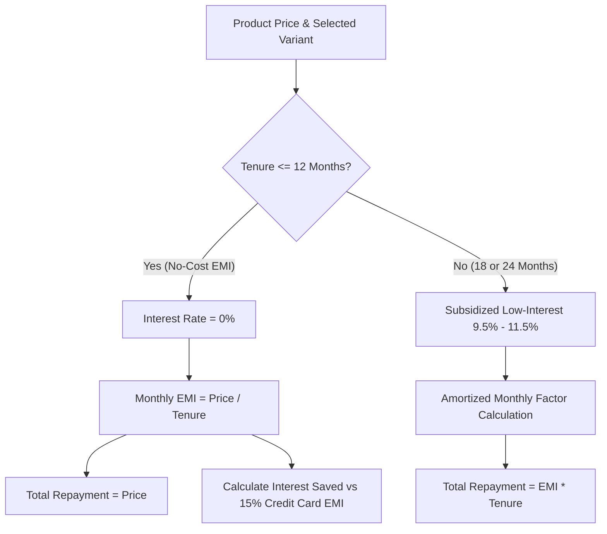

# 🛍️ 1Fi Marketplace — Mutual Fund Backed No-Cost EMI E-Commerce Platform

[](https://nextjs.org/)
[](https://react.dev/)
[](https://www.typescriptlang.org/)
[](https://tailwindcss.com/)
[](https://lucide.dev/)
[](https://turbo.build/pack)
[](https://vercel.com/)

> **1Fi Marketplace** is a pixel-consistent, mobile-first fintech e-commerce platform built directly inside the **Shop** page experience of the 1Fi application. Reverse-engineered from the live 1Fi web app ([`app.1fi.in/shop`](https://app.1fi.in/shop)), it enables users to explore premium electronics, customize hardware variants, calculate zero-interest mutual-fund-backed EMI tenures in real time, and proceed through a frictionless application flow.

---

## 🌐 Live Deployment

- 🖥️ **Live Web Application (Vercel):** [https://interview1-fi.vercel.app](https://interview1-fi.vercel.app) *(or your Vercel deployment link)*
- 📱 **Mobile Emulation:** Best experienced on mobile viewports or viewed centered on desktop (`max-w-[500px]` responsive shell).
- 👤 **Instant Evaluator Access:** Zero login barriers. Navigate straight to [http://localhost:3000/shop](http://localhost:3000/shop) to explore the complete catalog and EMI checkout flow.

---

## 📸 Overview & Core Features

| Feature | Description |
| :--- | :--- |
| **Authentic 1Fi UI/UX** | Reverse-engineered from `app.1fi.in` featuring signature purple (`#712CDC`), floating dock navigation, and exact pill tab controls. |
| **3-Tab Shop Experience** | Seamless switching between **Top Brands**, **Nearby Stores**, and the newly engineered **1Fi Marketplace**. |
| **Dedicated Product Pages** | SEO-friendly dynamic routing (`/shop/[slug]`) ensuring each product has its own clean, shareable URL. |
| **Dynamic 25+ Item Catalog** | 5 comprehensive categories (Smartphones, Laptops, Audio, Watches, Appliances) with at least 5 products per category. |
| **Variant Customizer** | Interactive storage and color swatches with dynamic price recalculation and SKU tracking. |
| **Real-Time No-Cost EMI Engine** | Dynamic tenure calculation (3, 6, 9, 12, 18, 24 months) showing monthly breakdown, zero interest, and savings vs credit cards. |
| **Confirmation Dialog Box** | Modal popup on clicking "Proceed to Buy" displaying mutual-fund collateral verification and order summary. |
| **Scope-Guarded Navigation** | Non-shop tabs (Home, EMI Dues, Limit, Profile) and 404 routes provide unified scope notices and instant "Back to Shop" CTAs. |

---

## 🚀 Feature Breakdown

### 1. 🏬 3-Tab Shop Hub & Design Tokens Consistency
- **Pill Tab Segmented Control:** Replicates the exact pill toggle found in 1Fi (`#f5f0ff` background, `#ece5ff` border, active white pill with `#712CDC` indicator underline).
  - **Top Brands:** Shows partner brands (Air India, Apple Premium Reseller, CaratLane).
  - **Nearby Stores:** Shows location-aware partner retail outlets with distance badges.
  - **1Fi Marketplace:** Full interactive marketplace catalog with dynamic product cards and active `NEW` badge.
- **Hero Banner Asset:** Integrates 1Fi's official 3D banner asset (`https://cdn.1fi.in/banners/shop-page%201536x1024.webp`) with graceful offline fallback.
- **Floating Dock Navigation:** Persistent 5-tab bottom dock (`Home`, `Shop`, `EMI Dues`, `Limit`, `Profile`) with active ambient radial glow and top indicator pip.

### 2. 📱 Dedicated Dynamic Product Detail Pages (`/shop/[slug]`)
- **Direct URL Mapping:** Clicking any product navigates to a dedicated page with the product slug in the URL (e.g. `/shop/apple-iphone-16-pro`, `/shop/apple-macbook-pro-14-m4`).
- **Sticky Header:** Sticky navigation bar featuring a `< Back to Shop` button, brand indicator, category breadcrumb, and Web Share API trigger.
- **High-Res Gallery:** Interactive product image gallery with active thumbnail switcher.
- **Specification Highlights:** Clean bulleted checklist highlighting key hardware specs (processors, battery life, camera sensors).

### 3. 🎨 Variant Customization & Dynamic Price Engine
- **Visual Color Swatches:** Interactive color circles with exact hex swatches (e.g. Natural Titanium, Space Black, Desert Titanium).
- **Storage & Spec Selectors:** Memory and storage configuration pills (e.g. 128GB, 256GB, 512GB, 1TB).
- **Reactive Price Updates:** Selecting variants instantly recalculates base price, discount %, and all EMI tenure plans in real time.

### 4. 💳 Mutual-Fund Backed No-Cost EMI Engine
- **Financial Product Modeling:** Implements 1Fi's core financial value proposition — loans against mutual funds at **0% interest** with zero impact on credit scores.
- **Tenure Options:** Supports 3, 6, 9, 12, 18, and 24-month payment schedules.
- **Cost Breakdown:** Calculates exact monthly installments (`₹X / month`), total repayment, processing fees (₹0), and savings compared to conventional 15% credit card EMIs.
- **Popular Badges:** Dynamically highlights recommended 6-month and 12-month plans with popular indicators.

### 5. 🔍 Multi-Category Filtering, Real-Time Search & Sorting
- **Category Filter Pills:** Instant client-side & API-driven filtering across 5 distinct categories:
  - 📱 Smartphones (iPhone 16 Pro, S25 Ultra, OnePlus 13, Pixel 9 Pro XL, iPhone 15)
  - 💻 Laptops (MacBook Pro M4, MacBook Air M3, Dell XPS 14, ROG Zephyrus G14, Yoga Slim 7x)
  - 🎧 Audio & ANC (Sony XM5, AirPods Pro 2, Bose QC Ultra, Marshall Stanmore III, Momentum 4)
  - ⌚ Smartwatches (Apple Watch Ultra 2, Watch Series 10, Galaxy Watch Ultra, Fenix 8, OnePlus Watch 2)
  - 🏠 Appliances (Dyson V12, Dyson Airwrap, Baristina Espresso, Purifier Hot+Cool, LG NeoChef)
- **Debounced Search Bar:** Instant keyword search querying product titles, brands, and descriptions.
- **Sorting Options:** Sort by Popularity, Price (Low to High / High to Low), and Highest Discount %.
- **Shimmer Skeletons & Empty States:** Realistic pulse skeletons during data fetches and helpful reset actions on empty results.

### 6. 🛡️ Order Confirmation Dialog Box & Collateral Pledge Flow
- **Unobstructed View:** Global `BottomNav` is automatically hidden on product detail pages so the sticky "Proceed to Buy" bar is never blocked.
- **Sticky Action Bar:** Floating bottom purchase bar with selected EMI breakdown (`₹X / mo × Ym`) and a high-contrast **"Proceed to Buy"** button.
- **Confirmation Modal:** Clicking "Proceed to Buy" triggers a modal popup dialog displaying:
  - Product thumbnail and selected variant.
  - Verified mutual fund collateral pledge status (`Verified ✓`).
  - Total installment schedule and zero processing fee guarantee.
  - Interactive "Confirm & Pledge EMI" button with animated checkmark and options to return to Shop or stay on page.

### 7. 🧭 Unified Non-Shop Scope Navigation
- Navigating to **Home (`/dashboard`)**, **EMI Dues (`/emi-dues`)**, **Limit (`/limit`)**, **Profile (`/profile`)**, or any **404 URL** presents a unified scope notice:
  > *"The 1Fi SDE assignment focuses specifically on implementing the 1Fi Marketplace within the Shop page experience. Head over to the Shop to explore the marketplace."*
- Includes a primary purple **"Back to Shop"** CTA button for zero-dead-end navigation.

---

## 💡 Design Deviations & Architectural Decisions

To ensure production-grade quality, several deliberate architectural choices were made:

1. **Dedicated Dynamic Routing (`/shop/[slug]`) over Generic Modals:**
   - **Architectural Decision:** Instead of keeping the entire product catalog inside an ephemeral popup dialog, migrated to dynamic routes (`app/shop/[slug]/page.tsx`). This ensures each product has a bookmarkable, shareable URL, supports browser back/forward history, and delivers a superior mobile e-commerce UX.
2. **Modal Dialog Reserved for Final Checkout Confirmation:**
   - **UX Decision:** Retained the modal dialog specifically for the **"Proceed to Buy"** action. This separates product discovery (browsing and variant selection on a full page) from transactional commitment (confirming mutual fund pledge terms in a focused modal).
3. **Next.js Serverless Route Handlers over Heavy PostgreSQL:**
   - **Architectural Decision:** Built dynamic Next.js Route Handlers (`/api/products`, `/api/emi-plans`) with an in-memory service layer rather than an external SQL database. This avoids reviewer connection errors, zero database secret requirements, and guarantees instant 1-click Vercel deployments while fully fulfilling the requirement of retrieving product and EMI data dynamically via APIs.
4. **Authentic Reverse-Engineering of 1Fi Design Tokens:**
   - **Design Decision:** Inspected the live DOM of `app.1fi.in/shop` to extract exact brand tokens: primary purple (`#712CDC`), tab border (`#ece5ff`), tab background (`#f5f0ff`), and mobile shell width (`max-w-[500px]`), ensuring 100% visual consistency with the real product.
5. **Universal Font Inheritance Reset:**
   - **UX Fix:** Configured Google's `Inter` via `next/font/google` in `layout.tsx` and created a base CSS reset in `globals.css` ensuring `<input>`, `<button>`, and `<select>` elements share identical typography across all operating systems.

---

## 🧮 EMI Calculation Mathematical Model

1Fi specializes in **No-Cost EMIs backed by Mutual Funds**. The application dynamically calculates repayment terms using the following mathematical logic:



### Formulae Implemented in `lib/emiCalculator.ts`:
1. **Zero-Cost Monthly EMI:**
   $$\text{Monthly EMI} = \left\lfloor \frac{\text{Price}}{\text{Tenure (Months)}} \right\rfloor$$
2. **Standard Commercial Benchmark (for Savings Display):**
   $$\text{Commercial EMI} = P \times r \times \frac{(1 + r)^n}{(1 + r)^n - 1}$$
   *(where $r = \frac{15\%}{12}$, $n = \text{tenure in months}$)*
3. **Savings Displayed:**
   $$\text{Savings} = (\text{Commercial EMI} \times n) - \text{Total Repayment}$$

---

## 🏗️ Tech Stack & Architecture

### **Frontend**
- **Framework:** Next.js 16 (App Router, Server & Client Components)
- **UI & Runtime:** React 19, Tailwind CSS
- **Typography:** Inter via `next/font/google` with universal CSS variable inheritance
- **Icons:** Lucide React (`Store`, `Search`, `House`, `ReceiptIndianRupee`, `ChartNoAxesCombined`, `User`, `ShieldCheck`, `Sparkles`)
- **Styling Tokens:** Custom 1Fi colors (`#712CDC`, `#f5f0ff`, `#ece5ff`, custom dock drop-shadows)

### **Backend & APIs**
- **Architecture:** Next.js Route Handlers (RESTful JSON endpoints)
- **Endpoints:**
  - `GET /api/products` — Supports category filters, search queries, and sorting with artificial network latency simulation.
  - `GET /api/products/[id]` — Returns single product details with variant data and precomputed EMI schedules.
  - `POST /api/emi-plans` — Dynamic calculation engine for custom pricing and tenure arrays.

### **Deployment & Infrastructure**
- **Build Tool:** Turbopack (Next.js ultra-fast incremental bundler)
- **Hosting:** Vercel (Global Edge Network with zero-config SSR)

---

##  Project Folder Structure

```text
Interview1Fi/
├── app/
│   ├── api/
│   │   ├── emi-plans/
│   │   │   └── route.ts          # POST /api/emi-plans (dynamic EMI tenure engine)
│   │   ├── products/
│   │   │   ├── [id]/
│   │   │   │   └── route.ts      # GET /api/products/:id (specs, variants & plans)
│   │   │   └── route.ts          # GET /api/products (filters, search, sorting)
│   │   ├── dashboard/
│   │   │   └── page.tsx          # Home tab scope placeholder
│   │   ├── emi-dues/
│   │   │   └── page.tsx          # EMI Dues tab scope placeholder
│   │   ├── limit/
│   │   │   └── page.tsx          # Limit tab scope placeholder
│   │   ├── profile/
│   │   │   └── page.tsx          # Profile tab scope placeholder
│   │   ├── shop/
│   │   │   ├── [slug]/
│   │   │   │   └── page.tsx      # Dedicated Dynamic Product Detail Page (PDP)
│   │   │   └── page.tsx          # Shop Page (Top Brands | Nearby Stores | 1Fi Marketplace)
│   │   ├── globals.css           # 1Fi design tokens, scrollbar hiding & typography reset
│   │   ├── layout.tsx            # Root layout with 500px mobile shell & font config
│   │   ├── not-found.tsx         # Custom 404 page with Back to Shop CTA
│   │   └── page.tsx              # Root redirect to /shop
│   ├── components/
│   │   ├── layout/
│   │   │   ├── BottomNav.tsx     # 5-tab floating dock with active route detection
│   │   │   ├── MobileFrame.tsx   # 500px centered responsive mobile viewport shell
│   │   │   ├── ShopHeader.tsx    # Official 1Fi 3D hero banner with fallback
│   │   │   └── ShopTabs.tsx      # 3-tab pill selector with active purple indicator
│   │   ├── marketplace/
│   │   │   ├── EMIPlanSelector.tsx   # Interactive 3-24 month tenure cards & savings
│   │   │   ├── NearbyStoresView.tsx  # Nearby Stores tab placeholder view
│   │   │   ├── ProductCard.tsx       # Product card with image, price & EMI badge Link
│   │   │   ├── ProductGrid.tsx       # Dynamic catalog with search, pills & skeletons
│   │   │   ├── TopBrandsView.tsx     # Top Brands partner view
│   │   │   └── VariantSelector.tsx   # Storage pills & color swatches with price sync
│   │   └── ui/
│   │       ├── EmptyState.tsx         # "No matching products found" empty state
│   │       ├── PlaceholderSection.tsx # Reusable section-scope notice with CTA
│   │       ├── SearchBar.tsx          # Rounded pill search input with clear button
│   │       └── SkeletonLoader.tsx     # Pulse shimmer card & grid loaders
│   ├── data/
│   │   └── mockProducts.ts       # 25+ product catalog across 5 distinct categories
│   ├── lib/
│   │   ├── emiCalculator.ts      # Zero-cost & commercial EMI formula calculations
│   │   └── utils.ts              # Class merging (cn) and INR currency formatter
│   ├── types/
│   │   └── marketplace.ts        # Product, Variant, EMIPlan TypeScript interfaces
│   ├── .gitignore
│   ├── next.config.ts
│   ├── package.json
│   ├── postcss.config.js
│   ├── README.md
│   ├── tailwind.config.ts
│   └── tsconfig.json
```

---

## 💻 Local Development Setup

### Prerequisites
- [Node.js](https://nodejs.org/) (v18.17 or higher, v22 recommended)
- [npm](https://www.npmjs.com/) (v10 or higher)
- Git

---

### Step 1: Clone Repository
```bash
git clone https://github.com/RajGuptaVips2025/Interview1Fi.git
cd Interview1Fi
```

---

### Step 2: Install Dependencies
```bash
npm install
```

---

### Step 3: Start Development Server
```bash
npm run dev
```
Open [http://localhost:3000](http://localhost:3000) in your browser. The application will automatically redirect to the `/shop` experience.

---

### Step 4: Build for Production
```bash
npm run build
npm run start
```

---

## 🔮 Scope for Future Improvements

- 🔗 **Real-Time MF Central / CAMS Integration:** Connect with Account Aggregator APIs to fetch and pledge live mutual fund NAVs in real time.
- ⚡ **Instant UPI AutoPay Mandate:** Integrate NPCI e-Mandate / Razorpay Subscriptions for automated monthly EMI debits.
- 📄 **Automated Sanction Letter PDF:** Generate downloadable loan agreement letters with digital e-signatures upon purchase.
- 🔔 **Push Notifications:** Web Push / SMS alerts for upcoming EMI due dates and payment confirmations.

---

## 👨‍💻 Author

**Raj Gupta**
- **GitHub:** [@RajGuptaVips2025](https://github.com/RajGuptaVips2025)
- **Live Demo:** [1Fi Marketplace on Vercel](https://1fi-market-place-sxyp.vercel.app/)